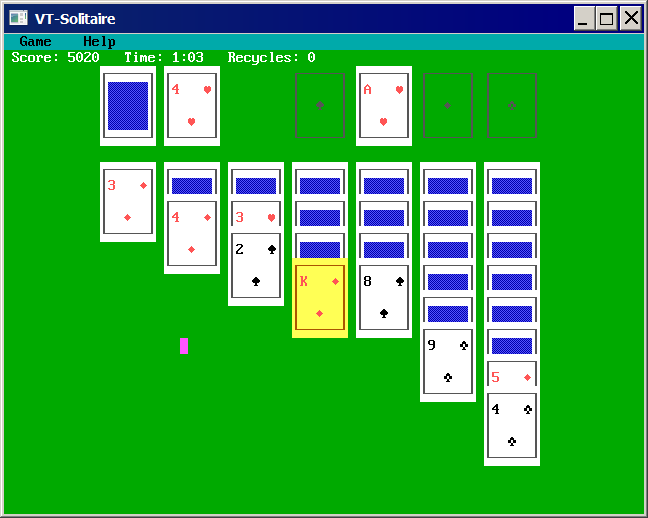

# VT — Virtual Text Screen Library for FreeBASIC

A self-contained library that gives you a DOS-style text screen in a real SDL2
window. One include, no SDL2 knowledge required. Feels like QBasic, works like 2026.

```freebasic
#include once "vt/vt.bi"

vt_title "My Program"
vt_screen VT_SCREEN_0
vt_color VT_YELLOW, VT_BLUE
vt_print_center 12, "Hello, World!"
vt_sleep
vt_shutdown
```

---

## Requirements

**FreeBASIC 1.10.1 + SDL2.**

- **Windows:** place `SDL2.dll` alongside your compiled executable.
  Get it from the [FreeBASIC library archive](https://github.com/rbreitinger/fb-lib-archive/tree/main/libraries/SDL2/SDL2-2.0.14).
- **Linux:** install via package manager (`libsdl2-dev` / `SDL2-devel` / `sdl2`).

---

## Installation

Copy the `vt` folder into FreeBASIC's `inc` directory:

- **Windows:** `C:\FreeBASIC\inc\vt\`
- **Linux:** `/usr/local/share/freebasic/inc/vt/`

Then in any source file: `#include once "vt/vt.bi"`

---

## Distributing programs

ship `SDL2.dll` alongside your executable (Windows).
Linux users have `libsdl2` system-wide.

If shipping source, note the dependency in your readme:
```
Requires: libvt — https://github.com/rbreitinger/libvt
```

---

## Features & Extensions

Optional extensions are pulled in by a single `#define` before the include —
zero overhead if unused.

| Feature / Extension | `#define` |
|---|---|
| CP437 fonts (8×8, 8×14, 8×16 embedded) | — |
| CGA 16-colour palette + manipulation | — | 
| All 256 CP437 glyphs | — |
| Blinking text (`VT_BLINK`) | — |
| Windowed / fullscreen / maximized | — |
| Scrollback buffer + Shift+PgUp/Dn | — |
| Scroll regions | — |
| Key input (`vt_inkey`, `vt_key_held`) | — |
| Blocking line editor (`vt_input`) | — |
| Mouse | — |
| Copy / paste | — |
| Multiple display pages | — |
| Custom font loading (`vt_loadfont`) | — |
| Screen save/load `.vts` (`vt_bsave/bload`) | — |
| Close-button callback (`vt_on_close`) | — |
| **ANSI** — ANSI Parsing support| `VT_USE_ANSI` |
| **Sound** — QBasic-style audio | `VT_USE_SOUND` |
| **Sort** — Shellsort + shuffle for all types | `VT_USE_SORT` |
| **Math** — Math helpers | `VT_USE_MATH` |
| **Strings** — String helpers| `VT_USE_STRINGS` |
| **File** — File I/O helpers | `VT_USE_FILE` |
| **TUI** — Text User Interface | `VT_USE_TUI` |
| **Net** — Sockets wrapper | `VT_USE_NET` |
| **TLS** — TLS 1.2/1.3 over TCP (requires VT_USE_NET) | `VT_USE_TLS` |

`VT_USE_TUI` automatically pulls in `VT_USE_STRINGS` and `VT_USE_FILE`.
`VT_USE_TLS` requires `VT_USE_NET` to be defined first.

---

## Screen Modes

| Constant | Cols × Rows | Font | Canvas | Original |
|---|---|---|---|---|
| `VT_SCREEN_0` | 80 × 25 | 8×16 | 640×400 | VGA text (default) |
| `VT_SCREEN_2` | 80 × 25 | 8×8 | 640×200 | CGA hi-res |
| `VT_SCREEN_9` | 80 × 25 | 8×14 | 640×350 | EGA |
| `VT_SCREEN_12` | 80 × 30 | 8×16 | 640×480 | VGA hi-res |
| `VT_SCREEN_13` | 40 × 25 | 8×8 | 320×200 | VGA Mode 13h |
| `VT_SCREEN_EGA43` | 80 × 43 | 8×8 | 640×344 | EGA 43-line |
| `VT_SCREEN_VGA50` | 80 × 50 | 8×8 | 640×400 | VGA 50-line |
| `VT_SCREEN_TILES` | 40 × 25 | 16×16 | 640×400 | Square tiles |
| `VT_SCREEN_100_40`| 100 × 40 | 8 × 16 | 800×640 | hi-res wide |
| `VT_SCREEN_100_50`| 100 × 50 | 8 × 8  | 800×400 | hi-res wide packed |
| `VT_SCREEN_120_45`| 120 × 45 | 8 × 16 | 960×720 | hi-res ultrawide |
| `VT_SCREEN_120_50`| 120 × 50 | 8 × 8  | 960×400 | hi-res ultrawide packed |

also custom screenmodes are supported up to 255x255, font sizes 8x8, 8x14 or 8x16

---

## Examples

The `examples/` directory contains runnable examples for most features.
VTetris is a complete Tetris game demonstrating sound, math and string extensions
working together — run `vtetris-bake.bas` once first to generate the screen assets.

---

## Programs made with libvt
| Program and Link | What it is |
|---|---|
| [VTIRC](https://github.com/rbreitinger/vtirc) | Fully functional minimalistic IRC client |
| [VTHELP](https://github.com/rbreitinger/vthelp) | A DOS-style .vth help file viewer|

**More Complete Programs in this repository**




---

## API Reference

**Full function reference, constants and parameter details**
[Online Version](https://rbreitinger.github.io/libvt/vt_api.html)
[Offline Version](https://github.com/rbreitinger/vthelp)

---

## License

MIT License — Copyright (c) 2026 Rene Breitinger (yorokobi)
[read LICENSE here](https://github.com/rbreitinger/libvt/LICENSE)