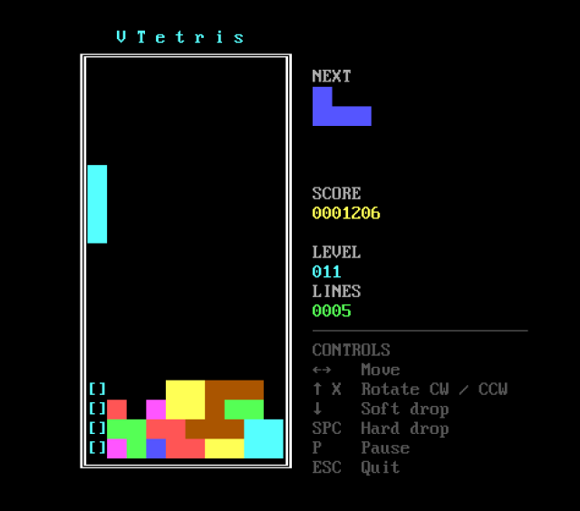

# VT — Virtual Text Screen Library for FreeBASIC

A self-contained library that gives you a proper DOS-style text screen in a real
SDL2 window — or directly in a terminal, no SDL2 needed. One include, no SDL2
knowledge required. Feels like QBasic, works like 2026.



```freebasic
#include once "vt/vt.bi"

vt_title "My Program"
vt_screen VT_SCREEN_0
vt_color VT_YELLOW, VT_BLUE
vt_print_center 12, "Hello, World!"
vt_sleep
vt_shutdown
```

---

## Backends

VT has two independent rendering backends selected by a `#define` before the include.

### SDL2 backend (default — full feature set)

No `#define` needed. Opens a real SDL2 window with an authentic IBM CP437 font,
palette, mouse, copy/paste, sound, and every other feature. This is the main mode
for desktop games and tools.

```freebasic
#include once "vt/vt.bi"   ' SDL2 backend, all features
```

Requires `SDL2.dll` (Windows) or `libsdl2` (Linux). See [Requirements](#requirements).

> **SDL2 backend and raw Linux TTY:**
> The SDL2 backend requires a graphical session (X11 or Wayland). Running it from a
> raw Linux console (Ctrl+Alt+F1–F6 outside a desktop session) is not supported — VT
> detects this via `TERM=linux`, prints a clear error, and exits cleanly instead of
> hanging. Launch your program from a terminal emulator inside a graphical session.
> If you specifically want raw TTY output, use the `VT_TTY` backend below.

### VT_TTY backend — headless terminal output (experimental)

```freebasic
#Define VT_TTY
#include once "vt/vt.bi"   ' TTY backend, no SDL2
```

Outputs directly to the terminal using ANSI escape sequences. No SDL2 dependency,
no window required. Useful for ssh sessions, CI, or tools that run in a terminal.

**Platform requirements:**
| Platform | Status |
|---|---|
| Linux (any terminal emulator) | ✅ Tested, fully working |
| Windows 10 build 1511+ | ✅ Implemented, community testing welcome |
| Windows < 10 (Win7 etc.) | ⚠️ Graceful no-op — opens console, does nothing, no crash |

**Known limitations of VT_TTY (by design or deferred):**
- Mouse, copy/paste, and sound are not available (no-op / return -1)
- `vt_key_held` always returns 0 (no live key-state query in raw TTY)
- Blink (`VT_BLINK`) is emitted but depends on terminal support — TERM=linux raw
  console does not implement it
- CP437 characters >= 128 (box-drawing, shaded blocks etc.) are sent as raw bytes;
  terminals expect UTF-8 so they show as garbage. UTF-8 translation is a planned
  future improvement
- `vt_font_reset` / `vt_loadfont` return -1 silently (no font texture in TTY mode)
- `VT_USE_SOUND` + `VT_TTY` together produce a compile error (intentional)

### VT_USE_ANSI — ANSI parser for vt_print (SDL2 backend only)

```freebasic
#Define VT_USE_ANSI
#include once "vt/vt.bi"   ' SDL2 backend + ANSI escape parser in vt_print
```

Enables ANSI escape sequence parsing inside `vt_print` while staying on the SDL2
backend. Useful when your string data already contains ANSI color codes (e.g. from
a network source or a log file). Supported sequences: SGR color/blink (`ESC[...m`),
CUP cursor position (`ESC[row;colH`), ED erase display (`ESC[2J`).

> `VT_TTY` implies `VT_USE_ANSI` automatically — you do not need both defines.

---

## Requirements

### SDL2 backend (default)

- **FreeBASIC 1.10.1**
- **SDL2** — platform-specific, see below

**Windows:** Get **SDL2.dll** from the
[FreeBASIC library archive](https://github.com/rbreitinger/fb-lib-archive/tree/main/libraries/SDL2/SDL2-2.0.14)
and place it alongside your compiled executable. If you are running the examples,
`SDL2.dll` must go inside the `examples/` folder, not the project root.

**Linux:** Install SDL2 via your package manager — FreeBASIC links against the system library automatically.

```bash
# Debian / Ubuntu
sudo apt install libsdl2-dev

# Fedora
sudo dnf install SDL2-devel

# Arch
sudo pacman -S sdl2
```

No `.so` file needs to be bundled; the user's system provides it.
Primary development and testing is done on Windows. Linux has not been
formally tested, but no Windows-specific code is used — all SDL2 calls,
FreeBASIC built-ins, and file I/O are cross-platform.

### VT_TTY backend

- **FreeBASIC 1.10.1**
- **No SDL2 required**
- Linux: any distribution with a terminal emulator
- Windows: Windows 10 build 1511 or later (earlier versions open a console but do nothing)

---

No other dependencies. All CP437 fonts are embedded — no external files needed.

---

## Installation

Clone or download this repository and copy the `vt` folder into FreeBASIC's `inc`
directory. This makes the library available to any project on your machine without
keeping copies in each project folder.

**Windows** (default FreeBASIC install path):
```
C:\FreeBASIC\inc\vt\
```

**Linux** (typical path):
```
/usr/local/share/freebasic/inc/vt/
```

Then in any source file:
```freebasic
#include once "vt/vt.bi"
```

---

## Distributing programs that use VT

### SDL2 backend — shipping an executable

Your compiled `.exe` has no dependency on the VT source files, but it does require
**SDL2.dll** at runtime. Place `SDL2.dll` in the same folder as your executable and
include it in any release archive you distribute.

### VT_TTY backend — shipping an executable

No DLLs required. The compiled executable is self-contained.
On Windows, it requires Windows 10 build 1511+ to produce any output.

### Shipping source code

Add a note in your readme that your project depends on libvt and point users to the
repository so they can install it:

```
Requires: libvt — https://github.com/rbreitinger/libvt
```

---

## Screen Modes

| Constant          | Cols × Rows | Font  | Canvas  | Original               |
|-------------------|-------------|-------|---------|------------------------|
| `VT_SCREEN_0`     | 80 × 25     | 8×16  | 640×400 | VGA text (default)     |
| `VT_SCREEN_2`     | 80 × 25     | 8×8   | 640×200 | CGA hi-res             |
| `VT_SCREEN_9`     | 80 × 25     | 8×14  | 640×350 | EGA                    |
| `VT_SCREEN_12`    | 80 × 30     | 8×16  | 640×480 | VGA hi-res             |
| `VT_SCREEN_13`    | 40 × 25     | 8×8   | 320×200 | VGA Mode 13h           |
| `VT_SCREEN_EGA43` | 80 × 43     | 8×8   | 640×344 | EGA 43-line            |
| `VT_SCREEN_VGA50` | 80 × 50     | 8×8   | 640×400 | VGA 50-line            |
| `VT_SCREEN_TILES` | 40 × 25     | 16×16 | 640×400 | Square tiles, game use |

Mode constants match original QBasic `SCREEN` numbers where applicable.
In `VT_TTY` mode, screen mode constants only affect the logical column/row count —
the terminal is not resized.

---

## Features

### SDL2 backend
- Authentic IBM CP437 fonts — 8×8, 8×14 and 8×16, all embedded
- Authentic CGA/DOS 16-colour palette with full palette manipulation
- All 256 CP437 glyphs — box drawing, shade blocks, symbols, the works
- Blinking text via `VT_BLINK`
- Windowed, fullscreen, maximized — integer scaling, nearest-neighbour rendering
- Scrollback buffer (`vt_scrollback`) with Shift+PgUp / Shift+PgDn
- Scroll regions — fixed headers, status bars, split-screen layouts
- Buffered key input (`vt_inkey`) and real-time key state (`vt_key_held`)
- Blocking line editor (`vt_input`)
- Mouse support with optional cursor and real-time position/button query
- Keyboard and mouse copy/paste
- Multiple display pages with PCOPY equivalent
- Custom BMP font loading at runtime (`vt_loadfont`)
- Screen save/load in `.vts` format (`vt_bsave` / `vt_bload`)
- Close-button callback (`vt_on_close`) — intercept the window [X] to guard unsaved data
- opt-in extensions on demand, zero overhead if unused

### VT_TTY backend
- Same `vt_print`, `vt_cls`, `vt_color`, `vt_locate`, `vt_input` API as SDL2
- ANSI SGR color output (correct CGA↔ANSI color mapping)
- Efficient diff-based rendering — only changed cells are emitted
- `vt_input` blocking line editor works in TTY mode
- Zero SDL2 dependency

---

## Extensions

Optional modules shipped with the library. Each is pulled in by a single `#define`
before the include — zero overhead if unused.

### vt_sound — QBasic-style audio

> **Not available in VT_TTY mode.** `#define VT_USE_SOUND` + `#define VT_TTY` together
> produce a compile error.

```freebasic
#define VT_USE_SOUND
#include once "vt/vt.bi"

vt_sound 440, 500                                    ' 440 Hz, 500 ms, blocking
vt_sound 262, 200, VT_WAVE_SQUARE, VT_SOUND_BACKGROUND  ' queue and continue
VT_BEEP                                              ' convenience macro
```

Square, triangle, sine and noise waveforms. Blocking or background playback
with a ~20 second queue buffer. No SDL2_mixer required — SDL2 core audio only.

### vt_sort — array sorting and shuffling

```freebasic
#define VT_USE_SORT
#include once "vt/vt.bi"

Dim nums(4) As Long = {5, 1, 4, 2, 3}
vt_sort nums(), VT_ASCENDING          ' 1 2 3 4 5
vt_sort nums(), VT_DESCENDING         ' 5 4 3 2 1

Dim words(2) As String = {"cherry", "apple", "banana"}
vt_sort words(), VT_ASCENDING         ' apple banana cherry

Randomize
vt_sort_shuffle nums()                ' Fisher-Yates in-place shuffle
```

Generic in-place Shellsort overloaded for all numeric types and `String`.
Two call forms: direction constant (`VT_ASCENDING` / `VT_DESCENDING`) or a custom
comparator callback for any ordering you need. `vt_sort_apply` applies a permutation
index to parallel arrays — the standard pattern for sorting multi-column tables.
No SDL2 or open screen required — usable in any FreeBASIC project.

### vt_math — grid and game math helpers

```freebasic
#define VT_USE_MATH
#include once "vt/vt.bi"

lvl_capped = VT_CLAMP(lvl, 1, 20)
dist       = vt_manhattan(px, py, ex, ey)
can_see    = vt_los(px, py, ex, ey, @is_wall)
vt_bresenham_walk x1, y1, x2, y2, @draw_cell
```

Macros: `VT_MIN`, `VT_MAX`, `VT_CLAMP`, `VT_SIGN`. Functions: `vt_wrap`,
`vt_lerp`, `vt_approach`, `vt_manhattan`, `vt_chebyshev`, `vt_in_rect`,
`vt_digits`, `vt_bresenham_walk`, `vt_los`, `vt_mat_rotate_cw/ccw`.
No SDL2 or open screen required — usable in any FreeBASIC project.

### vt_strings — string utility helpers

```freebasic
#define VT_USE_STRINGS
#include once "vt/vt.bi"

vt_print vt_str_pad_left(Str(score), 7, "0")        ' "0001450"
vt_print vt_str_wordwrap(long_text, 40)              ' wraps to width, Chr(10) delimited
tok_cnt = vt_str_split(csv_line, ",", parts())       ' split into dynamic array
```

`vt_str_replace`, `vt_str_split`, `vt_str_pad_left/right`, `vt_str_repeat`,
`vt_str_count`, `vt_str_starts_with`, `vt_str_ends_with`, `vt_str_trim_chars`,
`vt_str_wordwrap`. Pure FreeBASIC — no SDL2 or open screen required.

### vt_file — file and directory helpers

```freebasic
#define VT_USE_FILE
#include once "vt/vt.bi"

If vt_file_exists("save.vts") Then vt_bload "save.vts"   ' safe load guard

vt_file_copy "config.ini", "config.bak"                   ' backup before overwrite
vt_file_copy "data", "data_backup", VT_FILE_OVERWRITE     ' recursive tree copy

Dim files() As String
Dim cnt As Long = vt_file_list("maps", "*.vts", files())  ' directory listing
For i As Long = 0 To cnt - 1
    vt_print files(i) & VT_NEWLINE
Next i

vt_file_rmdir "tmp", VT_FILE_RECURSIVE                    ' delete populated tree
```

`vt_file_exists`, `vt_file_isdir`, `vt_file_copy` (single file or full recursive
tree with merge), `vt_file_rmdir` (recursive with explicit opt-in flag),
`vt_file_list` (wildcard directory scan into a String array, with flags for
hidden files, directories, or directories only). Pure FreeBASIC — no SDL2 or
open screen required.

---

## Examples

### VTetris

A complete Tetris implementation included in the repository, built entirely on
libvt. Demonstrates sound, math and string extensions working together in a
real game.

```
examples/vtetris.bas        — the game
examples/vtetris-bake.bas   — run once to generate the .vts screen assets
```

Controls: Arrow keys move and rotate, Space hard-drops, P pauses, Esc quits.
Run `vtetris-bake.bas` once before compiling `vtetris.bas` to generate the
required `resources/` files.

### ex_strings.bas

Runnable demonstration of every function in the `vt_strings` extension, with
labelled output and edge-case coverage.

```
examples/ex_strings.bas
```

### ex_close_guard.bas

Demonstrates `vt_on_close` — registering a callback for the window [X] button
to prevent accidental data loss. Shows both the clean-close path (no dialog)
and the confirmation dialog path when unsaved changes are present.

```
examples/ex_close_guard.bas
```

### many more examples
The `examples/` directory contains a good bunch of easy examples for the most commands.

---

## API Reference

Full function reference, constants, parameter details and alot of example codes:
**[rbreitinger.github.io/libvt/vt_api.html](https://rbreitinger.github.io/libvt/vt_api.html)**

---

## Basic Setup

### SDL2 backend
```freebasic
vt_title "Window Title"    ' optional, before or after vt_screen
vt_screen VT_SCREEN_0      ' open window -- VT_WINDOWED is the default flag
vt_scrollback 200          ' optional scrollback, call after vt_screen
```

Pass an init flag as the second argument to `vt_screen`:

```freebasic
vt_screen VT_SCREEN_0, VT_FULLSCREEN_ASPECT   ' integer-scaled fullscreen
vt_screen VT_SCREEN_0, VT_WINDOWED_MAX        ' start maximized
vt_screen VT_SCREEN_0, VT_WINDOWED Or VT_VSYNC
```

To change mode mid-program, call `vt_screen` again — it closes and reopens cleanly.

### VT_TTY backend
```freebasic
#Define VT_TTY
#include once "vt/vt.bi"

vt_screen VT_SCREEN_0   ' sets logical 80x25 grid, initializes terminal
vt_cls()
vt_color VT_BRIGHT_GREEN
vt_locate 1, 1
vt_print "Hello from TTY!"
vt_present()
vt_sleep 0
vt_shutdown()
```

Window flags (`VT_WINDOWED`, `VT_FULLSCREEN_ASPECT` etc.) are accepted but
silently ignored in TTY mode — the terminal is not resized.

---

## License

MIT License — Copyright (c) 2026 Rene Breitinger (yorokobi)
[read LICENSE here](https://github.com/rbreitinger/libvt/LICENSE)
